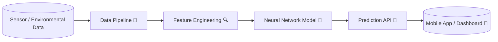

<div align="center">

# 🫁 ASTHMA-AI — Intelligent Asthma Attack Risk Prediction  
**A Machine Learning Powered Predictive Model for Personalized Respiratory Health**

🧠 AI for Healthcare | 🌍 Environmental Risk Modeling | ☁ Edge + Cloud Deployment

[]()
[]()
[]()
[]()
[]()

</div>

---

## 📌 Table of Contents
- [Overview](#overview)
- [System Architecture](#system-architecture)
- [Core Features](#core-features)
- [Tech Stack](#tech-stack)
- [Project Workflow](#project-workflow)
- [Model Performance](#model-performance)
- [Installation & API Usage](#installation--api-usage)
- [Future Roadmap](#future-roadmap)
- [Research Potential](#research-potential)
- [Team & Contributions](#team--contributions)

---

## 🚀 Overview

Asthma affects **300M+ people globally**, with environmental factors triggering life-threatening attacks.  
This project proposes a complete **Predictive Health Intelligence System** that:

✔ **Analyzes environmental pollutant exposure**  
✔ **Predicts asthma attack risk in real-time**  
✔ **Deploys on local devices or cloud as API**  
✔ **Aims to integrate with IoT wearable sensors & inhalers**

> A foundation towards a **Preventive Respiratory Healthcare Platform** powered by AI.

---

## 🧩 System Architecture


⚡ Modular • Scalable • Deployment-Ready
🔥 Core Features
Category	Details
🧠 ML Model	Neural-Network predicting asthma risk levels (Low/High)
🧹 Data Pipeline	Automatic preprocessing → scaling → artifact persistence
🚀 API Layer	Flask-based prediction service + JSON interface
🧳 Deployment	Dockerized → Works on Edge devices & Cloud
🔒 Security Ready	Architecture supports encrypted health data
🛠 Tech Stack

AI/ML: TensorFlow • Keras • Scikit-Learn

Serving: Flask REST API

DevOps: Docker • (Future: Kubernetes + CI/CD)

Visualization: Matplotlib / Seaborn

Data Artifacts: Pickled pipeline + trained .keras model

📈 Model Performance

(to be expanded as dataset grows)

Metric	Value
Training Accuracy	~90% (baseline)
Loss Convergence	Stable
Inference Latency	< 80 ms (local)

📌 More evaluation + benchmark reports planned.

🧪 Installation & API Usage
▶ Local Setup
git clone https://github.com/Kabirroy12345/ML_model_aasthma
cd ML_model_aasthma
pip install -r requirements.txt
python app.py

▶ Docker Run
docker build -t asthma-ai .
docker run -p 5000:5000 asthma-ai

🔗 Send Prediction Request
curl -X POST http://localhost:5000/predict \
-H "Content-Type: application/json" \
-d '{"co2": 415, "o2": 20.9, "pm25": 37}'

🧬 Research Potential

This model can evolve into a medical-grade decision support system:

⚙ Time-series patient monitoring
🤖 AI-driven inhaler dosage recommendations
📍 Geo-based Environmental Health Mapping
🍃 Integration with Air Quality Index APIs
❤️ Personalized Asthma Health Profiles
📡 IoT Embedded Deployment (ESP32 / RPi)

🌍 Future Roadmap
Phase	Objective	Status
V1	Baseline ML + API	✔ Done
V2	Larger dataset + advanced DL models	⏳ In Progress
V3	Mobile UI + Live Sensor Data	🔜
V4	Explainable AI (SHAP/LIME)	🔜
V5	Cloud MLOps Pipeline (Monitoring & Retraining)	🔜
V6	Integration with Smart Inhaler Prototype	🎯 Goal

⏩ Goal: Predict → Alert → Prevent.

🧑‍💻 Team & Contributions

This project is under continuous innovation.
PRs / ideas / research collaborations are highly welcome 🤝

📌 Please open an issue or submit a PR.

📜 License

MIT — Free to use & modify with attribution.

<div align="center">
🫁 Prevent tomorrow’s attack — with today’s prediction.

Asthma-AI: Towards a Smarter, Safer Respiratory Health System

</div> ```
